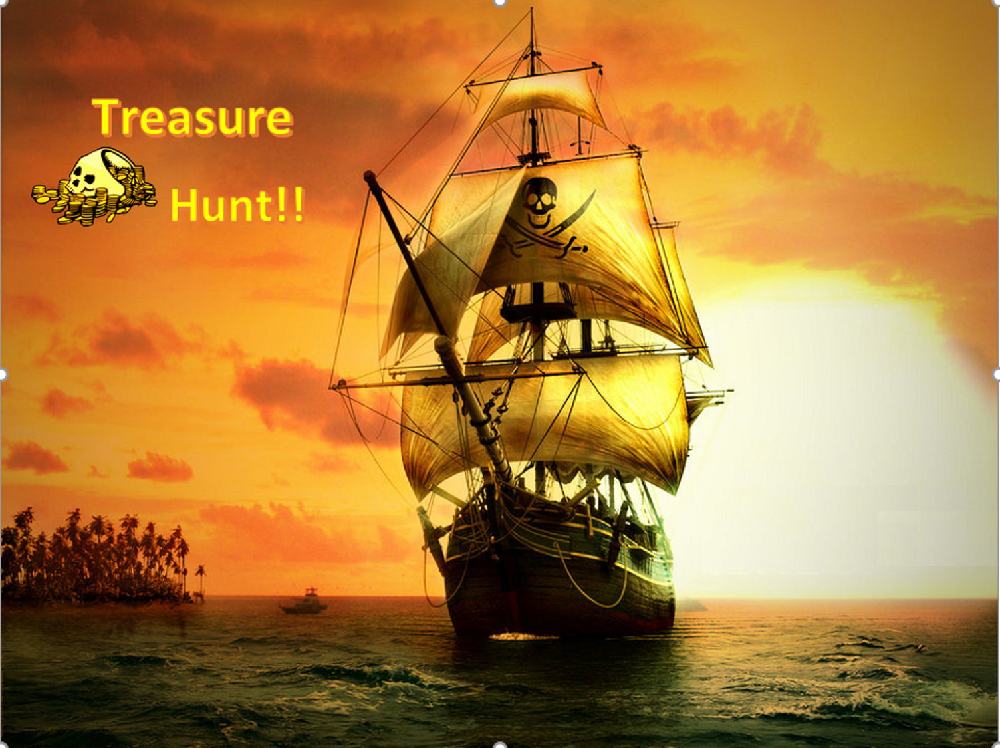

# Treasure Hunt

## Project Description :

A multiplayer Treasure Hunt based on FSA.Inspiration for the idea drawn From CS Unplugged. CS Unplugged is a collection of free learning activities that teach Computer Science through engaging games and puzzles that use cards, string, crayons and lots of running around. 
 
## Pirates - Treasure Hunt

## Game Story
It all began 1119 years ago, Jake Parrot hid his loot mostly gold at some place before getting arrested. As the treasure was not recovered rumours spread and people claimed to have seen Jake digging at multiple locations around the globe. Many young pirates vistied Jakes's wife to ask if she knows about the treasure location and she told them all she knew. Start at the Antartica he told to her before he was caught. She dispised his ways and said the money was cursed and all in pursuit have failed and have not returned. Do you wish to find the burried treasure? Is the adventure worth risking your life??

## Project Deliverables
[UI Wireframes] (Diagrams/UI Wireframes)  
[Class Diagram] (Diagrams/Class Diagram) 
[Sequence Diagram] (Diagrams/Sequence Diagram) 
[Activity Diagram] (Diagrams/Activity Diagrams) 
[Use Case Diagram] (Diagrams/Use Case Diagram) 

## Steps to Dockerize:

1. Develop a server code in Eclipse using Restler
2. Test the code usign Postman
3. Export the runnable jar file from Eclipse usign Export functionality
  - add jars in external folder
4. Test the jar file 
5. Create a docker file and run the command used in step 4 
6. Build a docker image using 'docker build -t pirates .'
7. Run docker using 'docker run --name pirates -td pirates'
8. Test the running docker container

## Note: To run in Multiplayer Mode
1. Set  multiPlayer = true in PirateWorld.java file located at 202-team16 folder.                       
2. Run the server code locally or on cloud and give the url in ClientAdapter.

## Contributing

1. Search previous suggestions before making a new one, as your's may be a duplicate.
2. Create an issue and describe your idea.
3. [Fork it] (https://github.com/amdh/202_Project1_Team16/fork)
4. Create a new branch for your feature (`git checkout -b my-new-feature`)
5. Commit the changes (`git commit -am 'Add some feature'`)
6. Publish the branch (`git push origin my-new-feature`)
7. Create a new Pull Request

Thank you for your suggestions!

## Developement Lifecycle Charts
### KanBan Flow Diagram (Phase 1)

[https://waffle.io/amdh/202_Project1_Team16/metrics/throughput]

### Scrum Burndown Chart (Phase 2)

## License

TreasureHunt is released under the [MIT License](https://github.com/amdh/202_Project1_Team16/blob/master/LICENSE.md).

## Pirates Team

| [ Aditya Parashar CMPE 202 - 03](https://github.com/AdityaParashar93)  | [ Amruta Dhodange CMPE 202 - 04](https://github.com/amdh)  | [ Arpita Dixit CMPE 202 - 04](https://github.com/ArpitaDixit)  | [ Chaya Malik CMPE 202 - 04](https://github.com/Chaya16)  | [ Jay Nirgudkar CMPE 202 - 03](https://github.com/jnirgudkar1)  |
| :----: | :----: | :----: | :----: | :----: |
